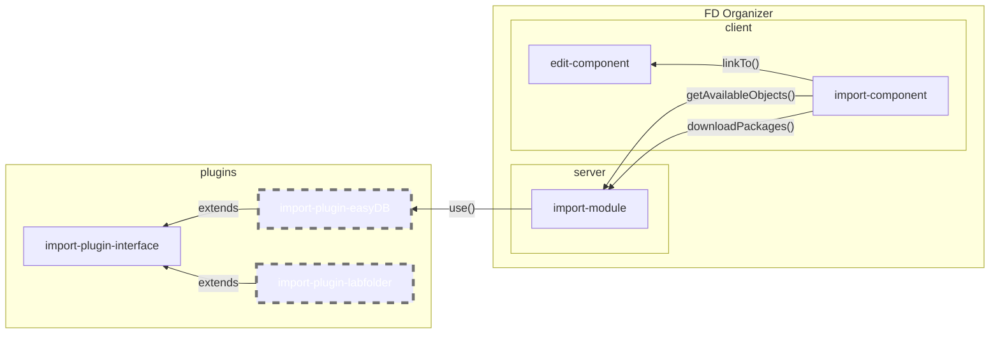

# LZV 

Projekt LZV des Bibliotheksverbund Bayern
## Installation
### Voraussetzungen

* Python 3.X ist installiert
* pip ist installiert
* Venv für die App ist vorhanden
* CouchDB-Instanz ist vorhanden
* CouchDB-Nutzer mit Berechtigung zum Anlegen von Datenbanken ist verfügbar

### Schritte

1. Aktivieren des venv 

    1. Linux
    
         ```bash
        source .venv/bin/activate
        ```
    
    2. Windows
    
        ```
        .venv\Scripts\activate.bat
        ```

1. Installation der Abhängigkeiten am Server (siehe `requirements.txt`)

    `pip install -r`

1. Installation des ldap-binaries

    1. Für Windows

        `pip install python_ldap-3.4.0-cp310-cp310-win_amd64.whl`

    2. Für Linux/macOS siehe [hier](https://www.python-ldap.org/en/python-ldap-3.3.0/installing.html)

1. Konfigurieren der CouchDB Zugangsdaten in `.server/conf/config.json`

    ```json
    {
        "couchDBBaseURL": "protocol[http|https]://host:port",
        "couchDBAdmin": "username",
        "couchDBPassword": "password"
    }
    ```

1. Erstellen von Datenbanken

    Datenbanken können mit Hilfe des Scripts *create_database* erstellt werden.

    ```python
        python create_database.py <database_name>
    ```
    Wird kein Name beim Start des Skripts übergeben, wird dieser nachträglich abgefragt.
    Die Namen der Datenbank können frei gewählt werden.
    Dadurch werden Namenskonflikte auf bestehenden Server-Instanzen vermieden.

1. Konfiguration der Datenbanken

    Nach dem Erstellen muss das Matching Datenbank <-> gespeicherte Entität in der Konfiguration hinterlegt werden

    ```json
    {
        "couchDBStorageDatabaseName": "storage",
        "couchDBMetaDataDatabaseName": "metadata",
        "couchDBDocumentDatabaseName": "documents",
        "couchDBStaticDatabaseName": "static",
        "couchDBIngestsDatabaseName": "ingests",
        "couchDBIngestReviewDatabaseName": "ingest_review"
    }
    ```

## Wartung

### Datenbanken verwalten

* Zurücksetzen von Datenbanken

    Während der Entwicklung in einer Testinstanz kann es Sinn machen, die Datenbanken des FDOrganizer zu leeren um keine überholten Daten zu nutzen.
    Dazu kann das Skript zum zurücksetzen der Datenbanken genutzt werden.

    ```python
        python reset_database.py <database_name>
    ```

    Wird der Name beim Start des Skripts nicht übergeben, wird dieser nachträglich abgefragt.

## Struktur

### Aufbau

```mermaid
%%{init:{'logLevel': 'debug', 'theme': 'base', 'gitGraph': {'showBranches': false}}}%%
gitGraph
commit id: "Initial commit"
commit id: "initial commit of server and client data"
commit id: "expanded selection Header with project selection"
commit id: "added mdb access in javascript"
commit id: "fixed error in categories get request"
commit id: "added debug output for mdb/items"
commit id: "added possibility to write mdb content to file system"
commit id: "added download button with automatic switch between project and mdb. Made it functional and fixed error in naming in labFolderEntries"
commit id: "minor layout changes"
commit id: "added new file and renamed another"
commit id: "added storage in cookie of login token and data"
commit id: "started preparations for storage integration, including a file which stores a json strcuture for already saved files for that user. streamlined file download to a single function with switches to avoid redundancy"
commit id: "streamlined download of file in a single function"
commit id: "fix in cookie name, fix in payload send, reduced sended data"
commit id: "fixes in server"
commit id: "expanded download function to additional field in preparation for storage file on server"
commit id: "added json file for storage file structure"
commit id: "updated server for storage file usage"
commit id: "updated server for storage structure"
commit id: "changed client to wokr with new storage system"
commit id: "bugfixes in server"
commit id: "expanded js for versionData, started implementing showing previous stored versions of entries"
commit id: "updated server to work with versionDate. updated server with method to return storageFile"
commit id: "updated server"
commit id: "updated client"
commit id: "restructure"
commit id: "restructured"
commit id: "unified development for flask webserver. flask now deploys the webpages and dynamically builds the websites with templates"
commit id: "started transformation of storage to couchDB"
commit id: "corrected stuff"
commit id: "removed unneccesary files"
commit id: "adapted to couchdb"
commit id: "bugfixes"
commit id: "fixed tabs"
commit id: "error fixes in server"
commit id: "started code refactoring"
commit id: "refactoring, linting, restructuring..."
commit id: "refactoring, linting, restructuring..."
commit id: "restructuring"
commit id: "implementation start for metaData management"
commit id: "implemented metaDataForms, started backend for meta data management"
commit id: "updated meta data generator"
commit id: "updated metadata generator. updated form for metadata generator. Added saving possiblity of user meta sets. Added adaptive metaset generation form."
commit id: "added purge sotrage file"
commit id: "added lzv.css"
commit id: "adaptions for going live on test"
commit id: "changed usage from cookie to local storage"
commit id: "added create db"
commit id: "changed server so it works on remote unix system"
commit id: "fixed errors in json processing on server. removed prefilled data in html forms. prepared for alpha test"
commit id: "streamlined imports"
commit id: "removed print commands"
commit id: "added login page in templates"
commit id: "added login page in templates"
commit id: "updated to current version : :)"
commit id: "update since long time. expnaded ingest form. added function on server for ingest submission and review"
commit id: "expanded review prozess, fixed lintiing errors in js"
commit id: "commit before branching rework of datastructure"
commit id: "started rework for generic flat datastructure instead of labfolder specific hierachical datastructure"
commit id: "fixed problems with changes generic datastructure. labfolder should now work as before"
commit id: "updated datastructure usage to be more generic"
commit id: "updated metadataschemestrucuture"
commit id: "updated metadataschemes"
commit id: "updated files for testing new scheme format including groups. also added test files for testint this rework. added structure files in json scheme format for schemestructure, export schemes and mapping schemes."
commit id: "finished update for grouping in metadata schemes. also fixed loading of grouped metadata sets"
commit id: "updated schemes and test files"
commit id: "updated metadata schemes for multiple fields"
commit id: "merge conflict"
commit id: "test-script for variable exports added. transfer to js code and integration in metadata generator next."
commit id: "added js file for metadata export logic"
commit id: "minor fix"
commit id: "added name field to export scheme"
commit id: "fixed bugs in metadata"
commit id: "added config files"
commit id: "updated metadata config files for datacite and dublin core schemes and export definitions"
commit id: "updated export definitions for complete datacite scheme"
commit id: "updated metadata form for new content, changed layout for better placing of elements in form"
commit id: "added icons"
commit id: "updated package module"
commit id: "added logos for ubt"
commit id: "added new files for upload of files functionality. integrated package manager. fixed errors"
commit id: "remove tmp files"
commit id: "updated upload functionality."
commit id: "added icon for trash"
commit id: "removed jshint files from repos"
commit id: "updated upload process. integrated functions for forms for consent and dsgvo. updated server to have the required functions available"
commit id: "added file for mets generation. implementation for mets generation started. bugfixes in package_manager. updated ingest_manager to work with new data scheme"
commit id: "push for recovery"
commit id: "updated mets generator."
commit id: "first prototype of ingest process finished. AIP generation is implemented."
commit id: "minor changes, some bugfixes"
commit id: "bug fixes"
commit id: "added mets file. bug fixes"
commit id: "updated mets generation to be valid rosetta mets"
commit id: "small fix in request storage file"
commit id: "added debug info"
commit id: " removed flask_session from repo"
commit id: "small fixes"
commit id: "added package for sending mails, minor updates and bug fixes, added logout button on all pages"
commit id: "added deletion of files of ingest to review fails"
commit id: "created method validate_user_session. All the checks in the REST Interface options for valid user login are now done  with this method. Removed all the checking at the start of each method to the new function"
commit id: "pre refactor, starting to put repositorys into modules"
commit id: "refactored labfolder and utility functions into seperate modules"
commit id: "reworked labfolder in seperate file. adapted config for change in hotfolder"
commit id: "bug fixes in ingest process"
commit id: "small fix"
commit id: "changed file ending for json files created during ingest process. it is now only .json not .pdf.json. rosetta seems to have problems with double extension filenames, this is a try to fix ingest problems."
commit id: "fix in mets.py for changed filename"
commit id: "fix in mets.py for changed filename"
commit id: "revoke update for filename, was not the reason for problem"
commit id: "minor fixes to complay with rosetta meta file format"
commit id: "added files for easydb integration"
commit id: "updated easydb download collection function. Base Function implemented, needs testing with some special cases. minor bug fixes in lzv_util."
commit id: "minor changes for usability"
commit id: "changed labfolderDownloadButton to repositoryDownloadButton to make it reusable with other repos"
commit id: "unified naming to repositoryDownloadButton for reusability, on LZVLabfolder changed usage of global variable to use browser storage instead. uses getLocalStorage(labFolderToken) instead of global var"
commit id: "simplified selection for versionList for displaying collection info"
commit id: "simplified selection for versionList for displaying collection info"
commit id: "minor changes in styling. some streamlining of in div naming. some minor fixes."
commit id: "added field origin_uuid to generic metadata and to the implementation of the repoman instanced. this is later being used during the ingest process to add these field to the indexed rosetta metadata fields. with this different versions of the same file can be identified in rosetta for future usage"
commit id: "added origin_uuid and content_origin to mets generation."
commit id: "expanded function to handle fixity values. either afte repo export fixity values are calucalted or taken from origin metadata. fixity is added to mets file to be user during ingest process to verify integrity of transferred data"
commit id: "small note about insitutional identifier"
commit id: "fix for hashinh binary labfolder data"
commit id: "added alerts after saving to notify user after success!"
commit id: "error fix during upload of data."
commit id: "adapted to labfolder backend change for image and file download which was broken for a while."
commit id: "fixed an error in calculate md5 checksum, accidently calculating sha226 sum instead"
commit id: "changed package manager to drag and drop instead of selecting and using buttons."
commit id: " added icons for checkmark"
commit id: "fixed error in appending child_ids to packages, resulting in only having a single child despite multiple files being uploaded"
commit id: "Update README.md"
branch cleanup
checkout cleanup
commit id: "Remove node_modules and package.lock"
commit id: "Add gitignore"
commit id: "Add requirements.txt"
commit id: "Improve create_database.py"
commit id: "Update README with Installation info"
commit id: "Use relative paths where possible"
commit id: "Use functions from create_database in purge script"
commit id: "Rename purge script to 'reset_database'"
commit id: "Move db scripts to main folder"
commit id: "Update README"
commit id: "Update gitignore with IDE settings"
commit id: "Check auth state automatically before requests"
commit id: "Add favicon and fix title"
commit id: "Serve app with self signed ssl certificate"
commit id: "Organize imports"
checkout main
merge cleanup
```



