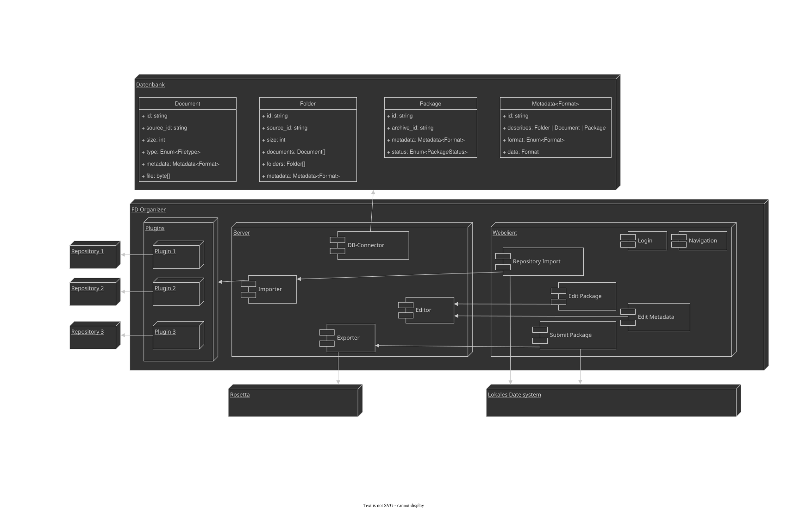

# FDOrganizer

## Beschreibung

Der FDOrganizer (kurz für Forschungsdatenorganizer) ist eine Webapplikation, die genutzt werden kann, um

1. Daten von einem Computer hochzuladen oder

1. mithilfe eines Plugins aus einem Storage-System (elektronisches Laborbuch, Gitlab) zu importieren und

3. die Daten mit Metadaten für die Archivierung anzureichern, um sie dann

4. von einem Datenkurator prüfen zu lassen. Sind die Daten geprüft, werden

5. die Daten für die Archivierung paketiert und für das Archivsystem (z.B. Rosetta) zum Import bereitgestellt

## Struktur

### Aufbau der Applikation



## Konfiguration


1. Konfiguration der FDOrganizer Umgebung `.env`.

    In `dummy.env` existiert eine beispielhafte Konfiguration.
    Die einzelnen Elemente werden in Folge erklärt.

    1. Konfigurieren der CouchDB Zugangsdaten

        1. Erstellen einer Datei im Projektverzeichnis mit dem Namen `.env`

        2. Setzen von Umgebungsvariablen, die für die Interaktion des FDOrganizer mit der Datenbank nötig sind (hier mit Beispielwerten)

            ```
            COUCHDB_USER=admin
            COUCHDB_PASSWORD=admin
            COUCHDB_HOST=127.0.0.1
            COUCHDB_PORT=5984
            ```

    1. Setzen von Umgebungsvariablen für den export von Datenpaketen in der .env-Datei

        1. Setzen eines Target-Verzeichnisses für exportierte Datenpakete in den Umgebungsvariablen

            ```
            EXPORT_DIR=/directory/for/exported/packages
            ```

        1. OPTIONAL: Erstellen eines linux-Nutzers für das Handling von exportierten Datenpaketen. Für das Einrichten eines sicheren Zugriffs auf die exportierten Daten via **SFTP** siehe z.B. [hier](https://thunderysteak.github.io/sftp-user-chroot)

            1. Überprüfe die ID des neu erstellten Linux-Nutzers

                ```bash
                id -u NUTZERNAME
                ```

            1. Setzen der Linux-Nutzer-ID in den Umgebungsvariablen
            
                ```
                EXPORT_USER=NUTZER_ID
                ```

    1. Setzen von Umgebungsvariable für Impressum-Link

        * Um ein externes impressum einzubinden muss eine Umgebungsvariable in `.env` hinzugefügt werden, die den Hyperlink zum Impressum enthält:

            ```
            IMPRESSUM_LINK=https://localhost:5000/impressum
            ```

        * Wird diese Variable nicht gesetzt, wird automatisch das HTML-Template `impressum.html` gerendert, das sich in `server/templates/` befindet.

    1. Setzen von Umgebungsvariable für das Login-Secret

        Beim Login in den FDOrganizer wird ein JWT-Token erstellt und im Browser gespeichert. Es dient zur Authentifizierung des Nutzers für alle weiteren HTTP-Anfragen die der FDOrganizer durchführt. Der Key sollte mindestens 512 Bit (also 64 Byte) lang sein.

        1. OPTIONAL: Erstellen des Secret Keys mit openssl

            ```
            openssl rand -base64 64
            ```

        1. Setzen des Secret Keys in `.env`

            ```
            TOKEN_SECRET=EbwDR8KR/dXAH55dMtTcqOqARfpwT04El7VlV3QiruXt4zaXiHOrvWd9Ic11UKPhZ98lAuBQ05kpmZ0EIXuJrg==
            ```

1. Konfiguration von FDOrganizer in der Datenbank

    In Folge werden die minimal nötigen Einträge für den Betrieb von FDOrganizer angelegt.
    Die Einträge können nachträglich über das Admin-Interface der CouchDB geändert oder gelöscht werden.
    (⚠️ Änderungen der Daten und erneutes Einspielen erzeugt Kopien!)

    Das Interface findet man typischerweise unter `http://couchdb-host:5984/_utils/`.


    1. Anlegen von Organisationen in der Datenbank

        Eine Installation des FDOrganizer kann von einer oder mehreren Einrichtungen genutzt werden. Dabei kann jede Einrichtung eine eigene Nutzerverwaltung, Authentifizierungsmethode und eigene Plugins nutzen. Dazu müssen Organisationen und Identityprovider in der Datenbank angelegt werden.
        
        Die Organisationen haben folgenden Aufbau:

        ```json
        {
            "idp_tag": "university.example",
            "name": "Example University",
            "reviewers": [
                "reviewer",
                "admin"
            ],
            "plugins": [
                "dummy"
            ],
            "export_subdirectory": "example_university_data_dir"
        }
        ```

        Dabei sind erwähnenswert:

        * `idp_tag` benennt die von einem Identityprovider referenzierte `organisation`,
          oder den Wert im `organisation_field` von Userinfo aus OIDC/Keycloak.
        * `reviewers` benennt jene, die Pakete prüfen dürfen. Dazu kann entweder die Nutzer-ID,
          oder der Anzeigename (`displayname_field`) verwendet werden; vorzugsweise ist dieses
          ein geprüftes Feld wie die Emailadresse, welche eine bessere Identifikation zulässt als
          die Pairwise-ID.

        Die Konfiguration kann mittels Skript in der Datenbank angelegt werden:
        ```sh
        python maintenance.py populate organisations my_organisation.json
        ```

        Nachträgliche Änderungen sind nur über Fauxton, der Admin-UI von Couch-DB vorzunehmen. 
        Erneute Ausführung des Skripts fügt eine Kopie ein, statt einen passenden Eintrag zu ersetzen.

    1. Anlegen von Identityprovidern

        Für den Login gibt es drei verschiedene Möglichkeiten.
        Nötig davon ist im Regelfall genau eine.

        1. Login über SSO (OIDC/Keycloak) für eine einzelne Organisation

            Für viele Fälle reicht ein Identity Provider, der auf eine Organisation zugeschnitten ist.
            Wichtig: Das Feld `organisation` dient zur Verknüpfung mit einer Organisation. 
            Dieses muss mit dem Eintrag `idp_tag` einer Organisation übereinstimmen.

            ```json
            {
                "name": "Login of Example University",
                "type": "KEYCLOAK",
                "client_id": "fdo",
                "client_secret": "12345678",
                "url": "https://localhost:8000/realms/master/protocol/openid-connect/",
                "username_field": "preferred_username",
                "displayname_field": "email",
                "organisation": "university.example",
                "scope": [
                    "openid",
                    "profile"
                ]
            }
            ```

        1. Login über SSO (OIDC/Keycloak) für mehrere gebündelte Organisationen

            Möchte man die Nutzer eines Identity Providers über Nutzerattribut in verschiedene Organisationen teilen, kann man das Feld `organisation_field` befüllen.

            ```json
            {
                "name": "Multi-Site Login",
                "type": "KEYCLOAK",
                "client_id": "fdo-multi-site",
                "client_secret": "12345678",
                "url": "https://localhost:8000/realms/master/protocol/openid-connect/",
                "username_field": "preferred_username",
                "displayname_field": "email",
                "organisation_field": "org",
                "scope": [
                    "openid",
                    "profile"
                ]
            }
            ```

            Konnte sich ein Nutzer authentifizieren, wird er der entsprechenden Organisation zugewiesen.
            Ist keine passende Organisation konfiguriert, wird der Login abgelehnt.

        1. Login über lokale Nutzer für Entwicklung und Testzwecke

            > [!WARNING]
            > Hochgradig unsicher: Bekannte Standartpasswörter, Passwörter nicht gehasht!
            >
            > Nur in einer geschlossenen Entwickungsumgebung verwenden, auf die nicht aus dem Netzwerk/Internet zugegriffen werden kann!
            
            Als Identityprovider dient eine kleine Konfig.

            ```json
            {
                "name": "Login of Example University [Local]",
                "type": "LOCAL",
                "organisation": "university.example"
            }
            ```

            Dazu kommt eine Liste von Nutzern.

            ```json
            [
                {
                    "username": "nutzer1",
                    "password": "passwort1"
                },
                {
                    "username": "nutzer2",
                    "password": "passwort2"
                },
                {
                    "username": "reviewer",
                    "password": "reviewer"
                }
            ]
            ```

            Die Berechtigungen werden über die Konfiguration der Organisationen vergeben.

        Die gewünschte Konfiguration kann mittels Skript in der Datenbank angelegt werden:
        ```sh
        python maintenance.py populate identityproviders my_identity_provider.json
        ```

        Bzw für Nutzer
        ```sh
        python maintenance.py populate users users.json
        ```

        Nachträgliche Änderungen sind nur über Fauxton, der Admin-UI von Couch-DB vorzunehmen. 
        Erneute Ausführung des Skripts fügt eine Kopie ein, statt einen passenden Eintrag zu ersetzen.

## Betrieb

### Lokal

#### Voraussetzungen

* Python in Version >=3.11 ist installiert
* pip ist installiert
* Virtual Environment für die App ist vorhanden
* CouchDB-Instanz ist vorhanden
* CouchDB-Nutzer mit Berechtigung zum Anlegen von Datenbanken ist verfügbar

#### Installation

1. Erstellen eines venv
    ```bash
    python3 -m venv .venv
    ```

1. Aktivieren des venv 

    1. Linux
    
        ```bash
        source .venv/bin/activate
        ```
    
    2. Windows
    
        ```
        .venv\Scripts\activate.bat
        ```

1. Installation der Abhängigkeiten

    ```bash
    pip install -r requirements.txt
    ```

1. Erstellen von Datenbanken

    Datenbanken können mit Hilfe des Scripts  `maintenance.py` erstellt werden.

    ```sh
    python maintenance.py databases
    ```

1. Befüllen der Datenbank

    Siehe Oben: Datenbankeinträge für Identityprovider, Organisation, und ggf. User.

1. Zum lokalen Ausführen der App können entweder das [Flask CLI](https://flask.palletsprojects.com/en/2.2.x/cli/) oder die Startskripte benutzt werden.
    Die Startskripte starten die App im Debug-Modus auf [`localhost:5000`](https://localhost:5000) und nutzen die mitgelieferten Self-Signed-Certificates zur SSL-Verschlüsselung.

    ```sh
    flask --app src --debug run
    ```

#### Wartung

* Zurücksetzen von Datenbanken

    Während der Entwicklung in einer Testinstanz kann es Sinn machen, die Datenbanken des FDOrganizer zu leeren um keine überholten Daten zu nutzen.
    Dazu kann das Skript zum zurücksetzen der Datenbanken genutzt werden.

    ```python
    python maintenance.py reset <database_name>
    ```

### Docker

#### Voraussetzungen

* Installiertes Docker-CLI (empfohlen: >= 23.0.6)
* Docker Compose Plugin (empfohlen: >= 2.17.3)

#### Installation

1. Setzen von Datenbanknutzer und -passwort wie unter [Konfiguration](#konfiguration) beschrieben.

1. Port Mapping für Datenbank und FDO in `docker-compose.yml` anpassen

    * Die Syntax für die Ports ist *hostsystem:container*.

    * Standardmäßig nutzt der FDO Port **34000** auf dem Hostsystem.

1. Das Anlegen der benötigten Datenbanken wird beim ersten Starten des FDO-Containers ausgeführt (siehe [`docker_init.sh`](./docker_init.sh))
   Dabei werden zudem die Dummy-Daten für Organisation (`dummy_organisation.json`) und Identity Providers (`dummy_keycloak_idp.json`, sowie `dummy_local_idp.json` und `dummy_local_users.json`) in die Datenbank eingespielt.

1. Wird das compose plugin für Docker zum Starten genutzt, kann der Cluster über `docker compose up` gestartet werden.
  ```
  docker compose --env-file dummy.env build
  docker compose --env-file dummy.env up
  ```

1. Die Default-Namen der Container können auch in `docker-compose.yml` angepasst werden mit dem Property `container_name`.

##### Bekannte Fehler

* `Temporary failure in name resolution` bei der Initialisierung der Datenbank.  
  Abhilfe: Docker neustarten.
  ```
  sudo systemctl restart docker
  ```

#### Wartung

##### "The Purge"
Ein cronjob führt per default eine zeitgesteuerte Löschung aller Dokumente in der Datenbank zwischen **20 Uhr und 8 Uhr des Folgetags** durch.
Angelegte Organisationen und Nutzer bleiben hiervon unberührt.
Für eine Nutzung im Produktionsmodus kann
    * ein anderer Zeitraum gewählt werden, indem `./cron_clean/cronjobs` angepasst wird
    * der container `cron` aus `docker-compose.yaml` entfernt werden

## Wartung

### Ablaufende Daten

Sollen nur Teile der Daten gelöscht werden, stehen alternativ die Skripte `cron_deleter.py` und `cron_purge_tombstones.py` zur Verfügung.

Bei Ausführung löscht `cron_deleter.py` alle Pakete, die älter als ein konfigurierter Zeitraum sind. Dabei wird jeweils der aktuelle Status und der Zeitpunkt der letzten Statusveränderung berücksichtigt.

CouchDB hinterlässt nach dem Löschen so genannte Thombstone Documents.
Im Falle verteilter Datenbanken werden diese benötigt, damit Dokumente auf allen verteilten Datenbank-Kopien gelöscht werden und nicht neu erstellt werden.

Im einfachen Fall nutzt FDOrganizer eine einzelne Datenbank, statt einer verteilten.
Die Tombstone Documents werden nicht benötigt und können auch gelöscht werden.
Dazu steht `cron_purge_tombstones.py` zur Verfügung.


## Plugins

Plugins für den FDOrganizer können vom Betreiber des FDO in wenigen Schritten installiert werden.

1. Auswahl eines Plugins. Hier gibt es die zwei Möglichkeiten:

    * Anpassung eines Plugins aus der Liste der existierenden Plugins, verfügbar auf [Github](https://github.com/ub-regensburg/FDOrganizer-plugins)

    * Schreiben eines eigenen Plugins auf Basis des mitgelieferten Dummy-Plugins

1. Plugin-Ordner dem Directory `server/plugins` hinzufügen

1. Plugin für eine Organisation aktivieren

    Der Name des Plugins muss der Organisation in der Liste der Plugins hinzugefügt werden (siehe *dummy_organisation.json*), erst danach wird es im FDOrganizer sichtbar.
    Dies geschieht manuell in der Datenbank über deren Weboberfläche.

## Geschichte

* 2020--2022: Projekt LZV des Bibliotheksverbund Bayern
* 2023--2025: ...
* 2026: Anpassungen für Projekt HITS FDM
  (Hochschulübergreifende IT-Services - Forschungsdatenmanagement)
